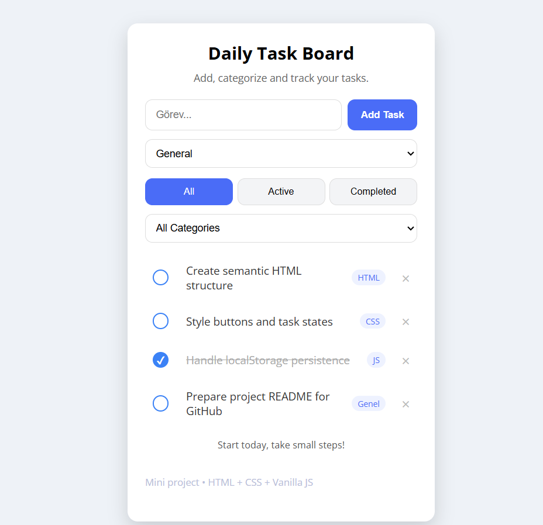

# 📝 Todo List App

A simple and functional **Todo List application** built with **HTML, CSS and Vanilla JavaScript**.

This project focuses on core JavaScript concepts such as DOM manipulation, event handling, filtering logic and localStorage usage.

---

## 🚀 Features

- ➕ Add new tasks  
- ✅ Mark tasks as completed  
- 🗑️ Delete tasks  
- 🏷️ Categorize tasks (HTML, CSS, JavaScript, General)  
- 🔍 Filter tasks by status (All / Active / Completed)  
- 💾 Persistent data with LocalStorage  

---

## 🛠️ Built With

- 🌐 HTML5  
- 🎨 CSS3  
- ⚙️ Vanilla JavaScript  

---

## 📚 What I Learned

- DOM manipulation with JavaScript  
- Handling events (click, keydown, change)  
- Managing application state  
- Filtering data based on multiple conditions  
- Using LocalStorage for data persistence  
- Debugging a real-world issue (HTML–JavaScript ID mismatch)

## 🔧 Possible Improvements

✏️ Edit task feature

🌙 Dark mode

📱 Better mobile UX

🧲 Drag & drop task sorting

🌐 Backend integration

##👤 Author

Şeyma Kayserili

Feel free to ⭐ the repository if you find it useful!

## 📸 Screenshot




---

## 📂 Project Structure

```text
├── index.html
├── style.css
├── script.js
└── todo-list-ss.png
```

